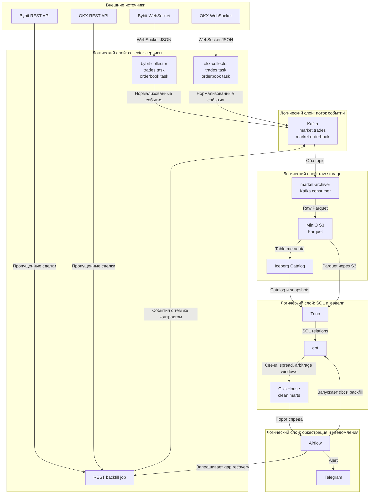

# Deployment diagram

```mermaid
flowchart TB
    subgraph EXCHANGES[Внешние источники]
        BYBIT[Bybit WebSocket]
        OKX[OKX WebSocket]
        BYBIT_REST[Bybit REST API]
        OKX_REST[OKX REST API]
    end

    subgraph COLLECTORS[Логический слой: collector-сервисы]
        B_COL[bybit-collector<br/>trades task<br/>orderbook task]
        O_COL[okx-collector<br/>trades task<br/>orderbook task]
        BACKFILL[REST backfill job]
    end

    subgraph STREAM[Логический слой: поток событий]
        K[Kafka<br/>market.trades<br/>market.orderbook]
    end

    subgraph RAW[Логический слой: raw storage]
        A[market-archiver<br/>Kafka consumer]
        M[MinIO S3<br/>Parquet]
        IC[Iceberg Catalog]
    end

    subgraph TRANSFORM[Логический слой: SQL и модели]
        T[Trino]
        D[dbt]
        C[ClickHouse<br/>clean marts]
    end

    subgraph ORCHESTRATION[Логический слой: оркестрация и уведомления]
        AIR[Airflow]
        TG[Telegram]
    end

    BYBIT -->|WebSocket JSON| B_COL
    OKX -->|WebSocket JSON| O_COL
    BYBIT_REST -->|Пропущенные сделки| BACKFILL
    OKX_REST -->|Пропущенные сделки| BACKFILL

    B_COL -->|Нормализованные события| K
    O_COL -->|Нормализованные события| K
    BACKFILL -->|События с тем же контрактом| K

    K -->|Оба topic| A
    A -->|Raw Parquet| M
    M -->|Table metadata| IC
    IC -->|Catalog и snapshots| T
    M -->|Parquet через S3| T
    T -->|SQL relations| D
    D -->|Свечи, spread, arbitrage windows| C
    AIR -->|Запускает dbt и backfill| D
    AIR -->|Запрашивает gap recovery| BACKFILL
    C -->|Порог спреда| AIR
    AIR -->|Alert| TG
```
