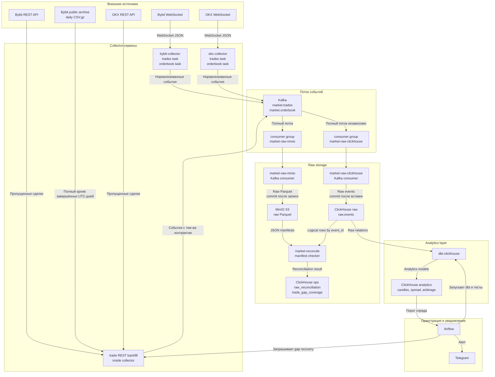

# Deployment diagram

```mermaid
flowchart TB
    subgraph EXCHANGES[Внешние источники]
        BYBIT[Bybit WebSocket]
        OKX[OKX WebSocket]
        BYBIT_REST[Bybit REST API]
        BYBIT_ARCHIVE[Bybit public archive<br/>daily CSV.gz]
        OKX_REST[OKX REST API]
    end

    subgraph COLLECTORS[Collector-сервисы]
        B_COL[bybit-collector<br/>trades task<br/>orderbook task]
        O_COL[okx-collector<br/>trades task<br/>orderbook task]
        BACKFILL[trade REST backfill<br/>inside collector]
    end

    subgraph STREAM[Поток событий]
        K[Kafka<br/>market.trades<br/>market.orderbook]
        G1[consumer group<br/>market-raw-minio]
        G2[consumer group<br/>market-raw-clickhouse]
    end

    subgraph RAW[Raw storage]
        A[market-raw-minio<br/>Kafka consumer]
        M[MinIO S3<br/>raw Parquet]
        CW[market-raw-clickhouse<br/>Kafka consumer]
        CR[ClickHouse raw<br/>raw.events]
        R[market-reconcile<br/>manifest checker]
        OPS[ClickHouse ops<br/>raw_reconciliation<br/>trade_gap_coverage]
    end

    subgraph ANALYTICS[Analytics layer]
        D[dbt-clickhouse]
        C[ClickHouse analytics<br/>candles, spread, arbitrage]
    end

    subgraph ORCHESTRATION[Оркестрация и уведомления]
        AIR[Airflow]
        TG[Telegram]
    end

    BYBIT -->|WebSocket JSON| B_COL
    OKX -->|WebSocket JSON| O_COL
    BYBIT_REST -->|Пропущенные сделки| BACKFILL
    BYBIT_ARCHIVE -->|Полный архив завершённых UTC-дней| BACKFILL
    OKX_REST -->|Пропущенные сделки| BACKFILL

    B_COL -->|Нормализованные события| K
    O_COL -->|Нормализованные события| K
    BACKFILL -->|События с тем же контрактом| K

    K -->|Полный поток| G1
    G1 --> A
    A -->|Raw Parquet<br/>commit после записи| M

    K -->|Полный поток независимо| G2
    G2 --> CW
    CW -->|Raw events<br/>commit после вставки| CR
    M -->|JSON manifests| R
    CR -->|Logical rows by event_id| R
    R -->|Reconciliation result| OPS

    CR -->|Raw relations| D
    D -->|Analytics models| C
    AIR -->|Запускает dbt и тесты| D
    C -->|Порог спреда| AIR
    AIR -->|Alert| TG
    AIR -->|Запрашивает gap recovery| BACKFILL
```
