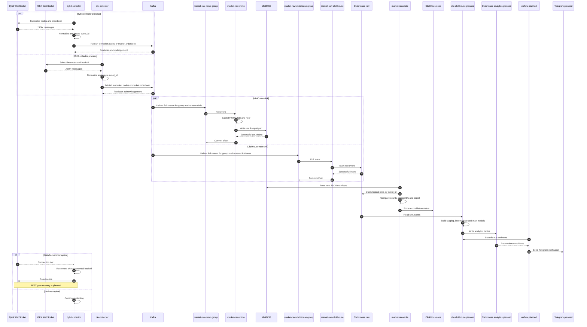

# Sequence diagram

```mermaid
sequenceDiagram
    autonumber

    participant BWS as Bybit WebSocket
    participant OWS as OKX WebSocket
    participant BC as bybit-collector
    participant OC as okx-collector
    participant K as Kafka
    participant GM as market-raw-minio group
    participant A as market-raw-minio
    participant M as MinIO S3
    participant GC as market-raw-clickhouse group
    participant CW as market-raw-clickhouse
    participant CR as ClickHouse raw
    participant R as market-reconcile
    participant OPS as ClickHouse ops
    participant D as dbt-clickhouse planned
    participant C as ClickHouse analytics planned
    participant AF as Airflow planned
    participant TG as Telegram planned

    par Bybit collector process
        BC->>BWS: Subscribe trades and orderbook
        BWS-->>BC: JSON messages
        BC->>BC: Normalize and create event_id
        BC->>K: Publish to market.trades or market.orderbook
        K-->>BC: Producer acknowledgement
    and OKX collector process
        OC->>OWS: Subscribe trades and books5
        OWS-->>OC: JSON messages
        OC->>OC: Normalize and create event_id
        OC->>K: Publish to market.trades or market.orderbook
        K-->>OC: Producer acknowledgement
    end

    par MinIO raw sink
        K->>GM: Deliver full stream for group market-raw-minio
        GM->>A: Poll event
        A->>A: Batch by UTC date and hour
        A->>M: Write raw Parquet part
        M-->>A: Successful put_object
        A->>GM: Commit offset
    and ClickHouse raw sink
        K->>GC: Deliver full stream for group market-raw-clickhouse
        GC->>CW: Poll event
        CW->>CR: Insert raw event
        CR-->>CW: Successful insert
        CW->>GC: Commit offset
    end

    R->>M: Read new JSON manifests
    R->>CR: Query logical rows by event_id
    R->>R: Compare counts, unique IDs and digest
    R->>OPS: Store reconciliation status

    CR->>D: Read raw.events
    D->>D: Build staging, intermediate and mart models
    D->>C: Write analytics tables
    AF->>D: Start dbt run and tests
    C-->>AF: Return alert candidates
    AF->>TG: Send Telegram notification

    alt WebSocket interruption
        BWS--xBC: Connection lost
        BC->>BC: Reconnect with exponential backoff
        BC->>BWS: Resubscribe
        Note over BC,BWS: REST gap recovery is planned
    else No interruption
        BC->>BC: Continue collecting
    end
```
