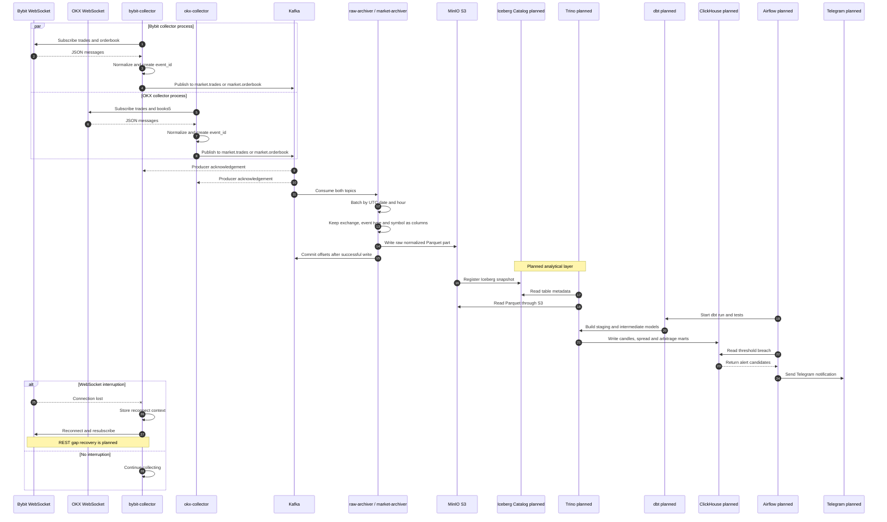

# Sequence diagram

В диаграмме явно разделены два collector-процесса. Компоненты с пометкой `planned` пока не реализованы.

```mermaid
sequenceDiagram
    autonumber

    participant BWS as Bybit WebSocket
    participant OWS as OKX WebSocket
    participant BC as bybit-collector
    participant OC as okx-collector
    participant K as Kafka
    participant A as raw-archiver / market-archiver
    participant M as MinIO S3
    participant IC as Iceberg Catalog planned
    participant T as Trino planned
    participant D as dbt planned
    participant C as ClickHouse planned
    participant AF as Airflow planned
    participant TG as Telegram planned

    par Bybit collector process
        BC->>BWS: Subscribe trades and orderbook
        BWS-->>BC: JSON messages
        BC->>BC: Normalize and create event_id
        BC->>K: Publish to market.trades or market.orderbook
    and OKX collector process
        OC->>OWS: Subscribe trades and books5
        OWS-->>OC: JSON messages
        OC->>OC: Normalize and create event_id
        OC->>K: Publish to market.trades or market.orderbook
    end

    K-->>BC: Producer acknowledgement
    K-->>OC: Producer acknowledgement
    K->>A: Consume both topics
    A->>A: Batch by UTC date and hour
    A->>A: Keep exchange, event type and symbol as columns
    A->>M: Write raw normalized Parquet part
    A->>K: Commit offsets after successful write

    Note over IC,T: Planned analytical layer
    M->>IC: Register Iceberg snapshot
    T->>IC: Read table metadata
    T->>M: Read Parquet through S3
    AF->>D: Start dbt run and tests
    D->>T: Build staging and intermediate models
    T->>C: Write candles, spread and arbitrage marts
    AF->>C: Read threshold breach
    C-->>AF: Return alert candidates
    AF->>TG: Send Telegram notification

    alt WebSocket interruption
        BWS--xBC: Connection lost
        BC->>BC: Store reconnect context
        BC->>BWS: Reconnect and resubscribe
        Note over BC,BWS: REST gap recovery is planned
    else No interruption
        BC->>BC: Continue collecting
    end
```

