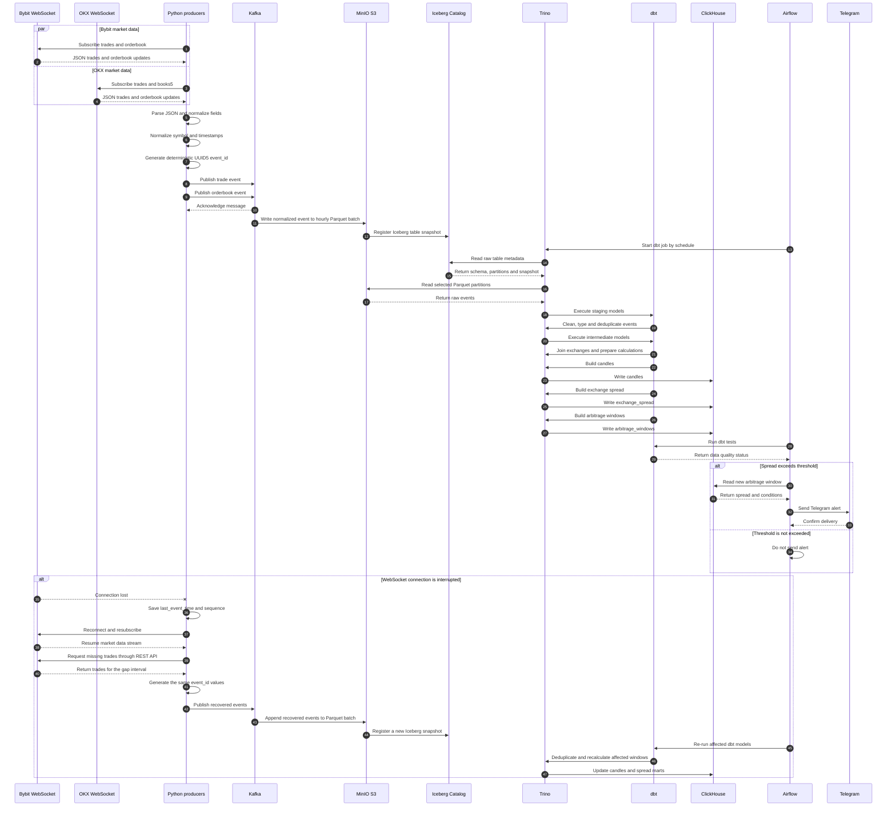

# Sequence diagram

```mermaid
sequenceDiagram
    autonumber

    participant B as Bybit WebSocket
    participant O as OKX WebSocket
    participant P as Python producers
    participant K as Kafka
    participant M as MinIO S3
    participant I as Iceberg Catalog
    participant T as Trino
    participant D as dbt
    participant C as ClickHouse
    participant A as Airflow
    participant TG as Telegram

    par Bybit market data
        P->>B: Subscribe trades and orderbook
        B-->>P: JSON trades and orderbook updates
    and OKX market data
        P->>O: Subscribe trades and books5
        O-->>P: JSON trades and orderbook updates
    end

    P->>P: Parse JSON and normalize fields
    P->>P: Normalize symbol and timestamps
    P->>P: Generate deterministic UUID5 event_id

    P->>K: Publish trade event
    P->>K: Publish orderbook event
    K-->>P: Acknowledge message

    K->>M: Write normalized event to hourly Parquet batch
    M->>I: Register Iceberg table snapshot

    A->>T: Start dbt job by schedule
    T->>I: Read raw table metadata
    I-->>T: Return schema, partitions and snapshot
    T->>M: Read selected Parquet partitions
    M-->>T: Return raw events

    T->>D: Execute staging models
    D->>T: Clean, type and deduplicate events
    T->>D: Execute intermediate models
    D->>T: Join exchanges and prepare calculations

    D->>T: Build candles
    T->>C: Write candles
    D->>T: Build exchange spread
    T->>C: Write exchange_spread
    D->>T: Build arbitrage windows
    T->>C: Write arbitrage_windows

    A->>D: Run dbt tests
    D-->>A: Return data quality status

    alt Spread exceeds threshold
        A->>C: Read new arbitrage window
        C-->>A: Return spread and conditions
        A->>TG: Send Telegram alert
        TG-->>A: Confirm delivery
    else Threshold is not exceeded
        A->>A: Do not send alert
    end

    alt WebSocket connection is interrupted
        B--xP: Connection lost
        P->>P: Save last_event_time and sequence
        P->>B: Reconnect and resubscribe
        B-->>P: Resume market data stream
        P->>B: Request missing trades through REST API
        B-->>P: Return trades for the gap interval
        P->>P: Generate the same event_id values
        P->>K: Publish recovered events
        K->>M: Append recovered events to Parquet batch
        M->>I: Register a new Iceberg snapshot
        A->>D: Re-run affected dbt models
        D->>T: Deduplicate and recalculate affected windows
        T->>C: Update candles and spread marts
    end
```
